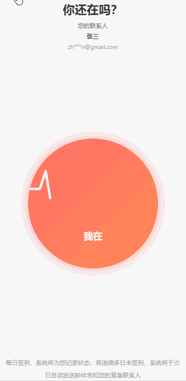

# 在吗？

为独居人群打造的轻量化安全工具，通过签到监测与紧急联络机制，构建无感化安全防护，让独处生活更安心。

## 项目介绍

在吗？是一款专为独居人群设计的安全工具，通过每日签到机制，当用户连续多日未签到时，系统会自动发送邮件通知紧急联系人，确保用户的安全。

## 功能特性

- ✅ **异常未签到自动通知**：当用户连续多日未签到时，系统自动发送邮件通知紧急联系人
- ✅ **即开即用无负担**：无需复杂设置，安装后即可使用
- ✅ **严格守护隐私安全**：采用加密技术保护用户信息，拒绝收集无关权限
- ✅ **适合所有独居人群**：简单易用，适合各个年龄段的独居用户

## 应用预览



## 技术栈

### 前端
- 框架：uni-app
- 语言：Vue.js
- 适配平台：微信小程序、APP、H5

### 后端
- 语言：Python
- 框架：Flask

## 快速开始

### 前端运行
1. 克隆项目
2. 使用HBuilderX或其他uni-app开发工具打开项目
3. 运行到对应平台

### 后端运行
1. 进入backend目录
2. 安装依赖：`pip install -r requirements.txt`
3. 启动服务：`python run.py`

## 项目结构

```
zaima/
├── frontend/          # 前端代码
│   ├── pages/         # 页面目录
│   ├── components/    # 组件目录
│   ├── static/        # 静态资源
│   ├── utils/         # 工具函数
│   ├── App.vue        # 应用入口
│   ├── main.js        # 主入口文件
│   └── pages.json     # 页面配置
├── backend/           # 后端代码
└── README.md          # 项目说明
```

## 联系方式

如有任何问题或建议，欢迎与我们联系：

公众号：阿锤科技

## 开源协议

MIT License

